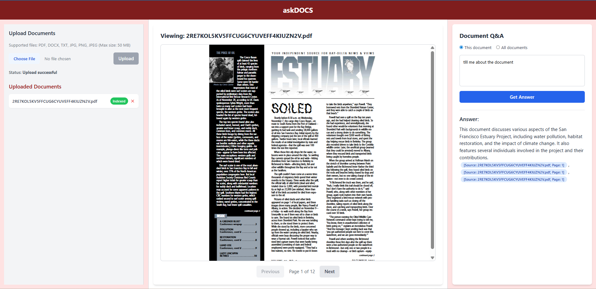

# askDOCS

## An AI-Powered Document Q&A System

This project, named **askDOCS**, is a full-stack, RAG-based AI application that allows users to upload documents (PDFs, DOCX, TXT, and images) and ask questions about their content. The system processes and indexes the documents in the background, providing grounded answers with clickable citations from the source material.

The application is built with a modern tech stack, including **FastAPI** for the backend and **React.js** for the frontend, ensuring a fast, responsive, and production-like user experience.

* * *

* * *

**Deployment & Hosting:**

The application uses resource-intensive libraries like `torch` and `doctr` for advanced OCR, which are not suitable for deployment on typical free serverless platforms (e.g., Vercel, Netlify) due to strict memory and CPU limits.

For a production environment, this application should be deployed on a virtual private server (VPS) or a dedicated cloud instance. We recommend using a containerized approach with **Docker** on a platform like **AWS EC2** or **Google Cloud Compute Engine** to ensure a consistent and reliable environment.

* * *

### Backend Directory Structure

```
    ├── app/
    │   ├── __init__.py
    │   ├── main.py                # Main FastAPI app, routers, CORS, and database setup
    │   ├── api/
    │   │   ├── __init__.py
    │   │   ├── endpoints/
    │   │   │   ├── __init__.py
    │   │   │   ├── upload.py      # File upload and ingestion pipeline trigger
    │   │   │   ├── qa.py          # Q&A logic and LLM interaction
    │   │   │   ├── download.py    # File download and on-the-fly conversion
    │   │   │   └── status.py      # Get document status and list
    │   │   └── models.py          # Pydantic models for data validation
    │   ├── services/
    │   │   ├── __init__.py
    │   │   ├── file_processor.py  # Handles text extraction and OCR
    │   │   ├── database.py        # SQLite database functions
    │   │   └── vector_db.py       # Manages FAISS index, embeddings, and retrieval
    │   └── core/
    │       ├── __init__.py
    │       ├── config.py          # Manages environment variables and settings
    │       └── utils.py           # Helper functions and decorators
    ├── data/
    │   ├── uploads/               # Directory to store uploaded documents
    │   ├── faiss_index/           # Directory to store FAISS index files
    │   └── ingestion_status.db    # SQLite database file for file status
    ├── extracted_text/            # Directory to store extracted text files
    ├── .env                       # Environment variables (e.g., GOOGLE_API_KEY)
    └── requirements.txt           # Project dependencies
```
### Frontend Directory Structure

```
    frontend/
    ├── public/
    │   └── pdf.worker.min.js      # PDF.js worker script for rendering
    ├── src/
    │   ├── assets/
    │   ├── components/
    │   │   ├── DocumentList.jsx    # Component for document list and status
    │   │   ├── DocumentViewer.jsx    # Component for PDF viewer
    │   │   ├── FileUploader.jsx      # Component for file upload
    │   │   └── QA_Panel.jsx          # Component for Q&A interface
    │   ├── App.jsx                   # Main application layout and state management
    │   ├── main.jsx                  # React entry point
    │   └── index.css                 # Main CSS file with Tailwind directives
    ├── package.json               # Frontend dependencies and scripts
    ├── tailwind.config.js         # Tailwind CSS configuration
    ├── postcss.config.js          # PostCSS configuration for Tailwind
    └── vite.config.js             # Vite build configuration

```

***


### Backend Setup (FastAPI)

# 

1.  **Clone the repository:**
    
    Bash
    
        git clone https://github.com/GitGautamHub/askDocs.git
        cd askDocs
    
2.  **Create a Python virtual environment and install dependencies:**
    This isolates the project's packages from your system's global Python installation.
    
    Bash
    
        python -m venv venv
        venv\Scripts\activate  # On Windows
        # or
        # source venv/bin/activate # On macOS/Linux
        pip install -r requirements.txt
    
3.  **Set up the environment variables:**
    
    *   Create a `.env` file in the root directory.
        
    *   Add your Google API key to the file. This is crucial for authenticating with the LLM.
        
    
    Code snippet
    
        GOOGLE_API_KEY="YOUR_GOOGLE_API_KEY"
    
4.  **Run the FastAPI server:**
    The `--reload` flag automatically restarts the server when you make changes to the code.
    
    Bash
    
        uvicorn app.main:app --reload
    
    The server will start, and the API will be available at `http://127.0.0.1:8000`.
    

* * *

### Frontend Setup (React.js)

1.  **Navigate to the frontend directory:**
    
    Bash
    
        cd frontend
    
2.  **Install the Node.js dependencies:**
    This will install all the packages listed in your `package.json` file.
    
    Bash
    
        npm install
    
3.  **Start the React development server:**
    This will compile the frontend and open the application in your default browser.
    
    Bash
    
        npm run dev
    
    The frontend will be accessible at `http://localhost:5173`.
    

* * *

With both the backend and frontend servers running, the application will be fully functional, and you can start uploading documents and asking questions.

***


### I. Why this stack? (Cost, Speed, Simplicity, Model Limits)

Our tech stack was chosen to balance performance, simplicity, and cost-effectiveness for a small, production-like demo.

*   **FastAPI** was chosen for the backend due to its high performance and asynchronous nature, which is ideal for handling I/O-bound tasks like file processing and API calls to LLMs. Its automatic OpenAPI documentation also simplifies development and testing.
    
*   **React.js with Vite** provides a fast, component-based frontend for a modern UI. **Tailwind CSS** was used for rapid, utility-first styling, allowing for a clean and professional design without writing custom CSS.
    
*   **SQLite** was used as the database for its simplicity and file-based nature, making it perfect for a single-tenant demo without needing a complex database setup.
    
*   **FAISS** serves as an efficient vector database for fast similarity searches. We opted for **BAAI/bge-small-en-v1.5** embeddings for their high quality and open-source, cost-free usage, and **Gemini 1.5 Flash** as the LLM for its speed.
    

### II. Ingestion Trigger & Incrementality

Newly uploaded files are processed automatically and become searchable without a server restart. The exact mechanism is as follows:

1.  A user uploads a file via the frontend.
    
2.  The frontend makes a `POST` request to the `/api/upload` endpoint.
    
3.  FastAPI receives the file and initiates an asynchronous background task (`BackgroundTasks`).
    
4.  This background task runs the `process_file_pipeline` function, which performs the entire ingestion process (extract, chunk, embed, index).
    
5.  This asynchronous approach prevents the API from timing out and allows the server to handle other requests while the document is being processed.
    
6.  The new document's index is stored in a separate FAISS file. The `merge_faiss_indexes` function can then dynamically load this new index, making the document instantly searchable.
    

### III. Chunking/Window/Overlap + Top-k

*   **Chunking:** The document text is split into chunks of **800 tokens** with a **200-token overlap**. The large chunk size provides more context for the LLM, and the generous overlap ensures that crucial information is not split between chunks.
    
*   **Metadata:** Each chunk is stored with metadata: `{doc_id, doc_name, page, chunk_id, ts}`. The `page` number is intelligently assigned (e.g., `1` for all chunks from an image or TXT file, and sequential numbers for a multi-page PDF).
    
*   **Top-k Retrieval:** The system retrieves the **top-10** most relevant chunks. This value provides a good balance, giving the LLM sufficient context to generate a high-quality answer without overwhelming it with too much information.
    

### IV. Prompting Strategy

The core of the RAG system's intelligence lies in its prompt. The system uses a carefully crafted prompt to ensure grounded, accurate, and concise answers.

**System Prompt:**
```
You are an expert AI assistant that provides answers based solely on the provided documents.
    Answer the following question using ONLY the context provided below.
    If the context does not contain enough information to answer the question, state that you cannot find the answer in the documents.
    Do not make up any information.
    Context:
    {context}
    Question: {question}
    Provide a concise answer. Always give top 3 citations using the format [Source: doc_name, Page: page_number].
```
This prompt includes hallucination controls (`Do not make up any information`) and specifies the exact citation format required.

### V. Failure Modes Handled

The application is designed to handle common failure scenarios gracefully:

*   **Bad PDFs/Extraction Errors:** The system first attempts to extract text with `pdfplumber`. If the text quality is poor or the extraction fails, it automatically falls back to an OCR-based approach using `python-doctr`.
    
*   **API Errors:** The `try-except` blocks in the backend handle API failures, returning a `500` error to the frontend.
    
*   **File Errors:** Errors related to file sizes, types, or missing files are handled with friendly error messages on both the frontend and backend.
    
*   **Timeouts:** The asynchronous background task for ingestion prevents API timeouts for large files.
    
*   **Rate Limits:** While explicit rate limiting is not implemented for this demo, the asynchronous design is robust enough to handle multiple concurrent requests without blocking the main event loop.
    

### VI. Limits Imposed

The following limits have been imposed on the system:

*   **File Types:** Only `PDF`, `DOCX`, `TXT`, `JPG`, `PNG`, and `JPEG` are accepted. This ensures the ingestion pipeline can process the files correctly.
    
*   **File Size:** A maximum file size of **50 MB** has been set on both the client and server to prevent resource exhaustion and ensure reasonable processing times.
    
*   **Page Counts:** No explicit page count limit has been set, but the system is tested to handle over 100 pages.
    
### VII. Cost Estimate 
The primary operational costs for this application are associated with the LLM usage, while other components are designed to be cost-effective.

*   **LLM (Gemini 1.5 Flash):** The main expense is for API calls to Gemini. As a serverless LLM, the cost is based on the number of input and output tokens processed. A typical document (e.g., a 5 MB PDF) might cost only a few cents for processing and embedding. Each user query will also incur a small cost, depending on the length of the query and the generated response.
    
*   **Open-Source Tools:** All core components, such as **LangChain**, **FAISS**, **doctr**, and the **BAAI** embedding model, are free to use. These libraries are crucial for the RAG pipeline and advanced OCR but do not incur direct costs.
    
*   **Serverless Deployment:** For deployment, platforms like **Vercel** and **Render** offer a generous free tier for both the frontend and backend. This is more than sufficient for a low-traffic demo or personal use.
    

**Estimated Monthly Cost:**

For a single-user demo with light to moderate usage, the estimated monthly cost would be minimal, likely **less than $5**. This is primarily for the LLM API calls.